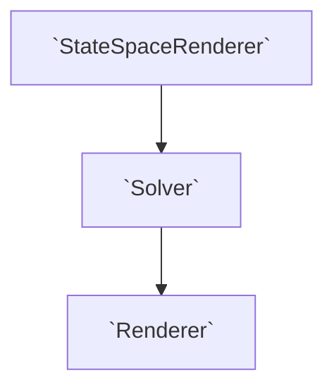
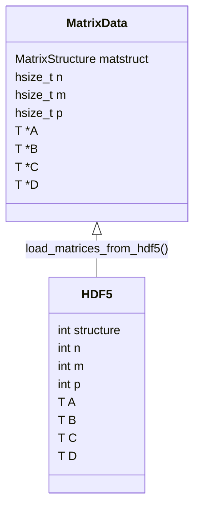

# Benchmarks

Current benchmarks can be found [here](https://artpelling.github.io/state-space-renderer/benchmarks/)

# Installation for Linux

## Dependencies

- autotools

  ```shell
      sudo apt-get install autotools-dev
      sudo apt-get install autoconf
  ```

- cmake

  ```shell
      sudo apt-get install cmake
  ```

- g++
- HDF5 C API

  ```shell
      sudo apt-get install libhdf5-dev
  ```

- Jack Audio Connection Kit

  ```shell
      sudo apt-get install libjack-dev
  ```

- BLAS

  ```shell
      sudo apt-get install libblas-dev
  ```

- JACK Pipewire Support

  ```shell
      sudo apt-get install pipewire-jack
  ```

## Compilation

The package can be compiled by running

```shell
    autoreconf -vif
    mkdir build && cd build
    ../configure
    make
```

### Apple silicon

In order to compile against Apple's Accelerate framework, the library path needs to be supplied to the configure script, e.g.:

```shell
mkdir build && cd build
../configure CPPFLAGS=-I/Library/Developer/CommandLineTools/SDKs/MacOSX14.2.sdk/System/Library/Frameworks/Accelerate.framework/Versions/A/Frameworks/vecLib.framework/Headers
make
```

## Data

We have constructed the following templated base classes to process state space systems:

1. `StateSpaceRenderer`: Defines the discrete linear state space equations,

   $$
   x_{t+1}=Ax_t + Bu_t\\ y_t=Cx_t+Du_t
   $$

   where $A\in\mathbb{R}^{n\times n}, B\in\mathbb{R}^{n\times m},C\in\mathbb{R}^{p\times n},D\in\mathbb{R}^{p\times m}$.

   Inputs are defined by $u_t\in\mathbb{R}^m$ and outputs by $y_t\in\mathbb{R}^p$.

2. `Solver`: Defines the way the discrete linear state space equations are solved.
3. `Renderer`: Defines how the solver is mounted to a sound server for implementation.

The flow of the classes is structured in such a way:



## State Space System HDF5 import support

Using `utils.h::load_matrices_from_hdf5`, one can import state-space system setups from HDF5 files to a `MatrixData` class which stores the shape, matrices and structure of the class.



Note that by default this library uses a column-major order storage to perform computation. However, HDF5 only admits an row-major order storage. To solve this, we use a simple transpose of the matrix. An example of this can be seen in `save_system` from `utils.py`.

For the structure storage we use the following enumeration:

- General = 0,
- Triangular = 1,
- Diagonal = 2,
- Tridiagonal = 3,
- FullHessenberg = 4,
- MixedHessenberg = 5.

Please store the enumeration corresponding to the structure in the HDF5 file to keep the correct matrix structure when importing.
